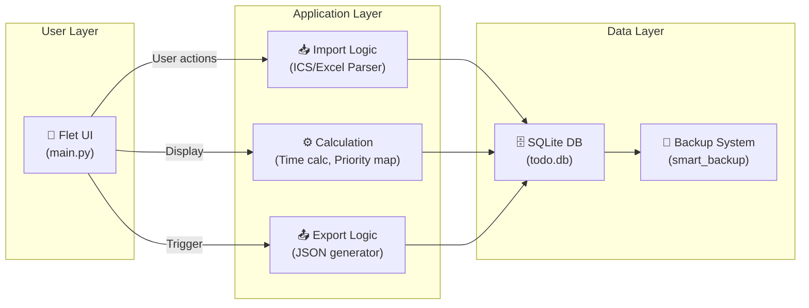
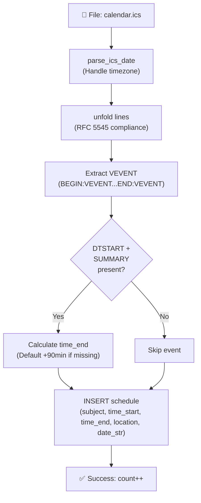
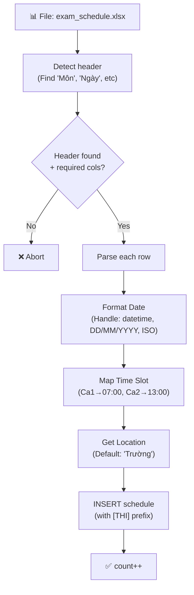
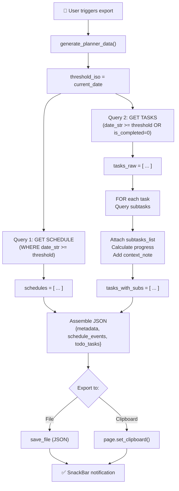

# Kiến trúc hệ thống microSchedule

Tài liệu này mô tả luồng hoạt động của microSchedule - một ứng dụng quản lý lịch học + to-do tối ưu cho ôn thi.

## 1. Mô hình "Desktop Client" (Flet-Centered)

microSchedule là **Standalone Desktop App** với mô hình self-contained: tất cả logic nằm trong app, database là local SQLite.



## 2. Luồng Ingestion (Import -> Parse -> Store)

### 2.1 ICS Import (Lịch từ Google Calendar/Outlook)


### 2.2 Excel Import (Lịch thi từ tệp lịch thi)


**Key Strategy**:
- ICS = dùng cho lịch học cố định (import từ Google Cal)
- Excel = dùng cho lịch thi (smart detect + format inference)

## 3. Luồng Core Data Management

### 3.1 Task Lifecycle
```
📝 User creates task
    ↓
[task] table: (title, priority, date_str, note)
    ↓
User adds subtasks → [subtask] table: (task_id, content, is_completed)
    ↓
generate_planner_data() →
    - Aggregate: All tasks + subtasks
    - Add context: OVERDUE vs UPCOMING
    - Add progress: done_sub / total_sub
    ↓
📊 Export JSON / Display in UI
```

### 3.2 Priority System (Settings-based)
```
settings["priorities"] = [
  {name: "Optional", color: "Grey", icon: "Low"},
  {name: "Nên làm", color: "Green", icon: "Check"},
  {name: "Phải làm", color: "Amber", icon: "High"},
  {name: "Bỏ là nhót", color: "Orange", icon: "Danger"},
  {name: "Nguy hiểm", color: "Red", icon: "Warning"}
]

UI queries get_prio_config(prio_name) → (color, icon, label)
```

## 4. Luồng Export (Generate Planner Data)

**Target**: Tạo JSON structured để dùng với AI (ôn tập)



**JSON Structure**:
```json
{
  "metadata": {
    "generated_at": "2025-05-25 14:30:00",
    "threshold_date": "25/05/2025",
    "description": "..."
  },
  "schedule_events": [
    {subject, time_start, time_end, location, date_str},
    ...
  ],
  "todo_tasks": [
    {
      id, title, priority, date_str, note,
      subtasks_list: [{content, is_completed}, ...],
      context_note: "OVERDUE/UPCOMING. Tiến độ: X/Y"
    },
    ...
  ]
}
```

## 5. Thành phần chính (Core Components)

### `database.py` - Data Access Layer
| Hàm | Mục đích |
|-----|---------|
| `init_environment()` | Tạo DB + load default settings |
| `load_settings()` | Lấy config từ settings table |
| `save_single_setting()` | Cập nhật 1 setting |
| `import_ics_schedule()` | Parse + store ICS |
| `import_excel_schedule()` | Parse + store Excel |
| `export_planner_data()` | Xuất JSON |
| `perform_smart_backup()` | Auto-backup (max 15, interval 2h) |

### `main.py` - UI Layer
| Hàm | Mục đích |
|-----|---------|
| `main(page)` | Entry point, khởi tạo state + overlay |
| `refresh_all()` | Reload settings + re-render |
| `generate_planner_data()` | Frontend version của export (use global cur) |
| `export_data_to_json()` | Dialog cho export option |
| `handle_file_picker_result()` | Process import/export file |
| `load_day_view()` | Render task list + schedule cho ngày |
| `load_month_view()` | Render calendar grid |
| `get_prio_config()` | Map priority → UI (color, icon) |

### Cấu trúc State (trong main)
```python
# Global state
current_date          # Ngày hiện tại view
current_month_view    # Tháng đang xem
APP_CONFIG           # Loaded từ settings table

# UI Refs
lbl_current_date, lbl_month_title  # Labels
container_tasks, container_schedule, container_calendar_grid  # Containers
tabs_control         # Tab switcher
```

## 6. Cấu hình & Data Paths

**Hardcoded paths** (⚠️ Machine-specific):
```python
DATA_DIR = r"C:\Users\os\Desktop\Tools\VC_microSchedule_home"
DB_PATH = os.path.join(DATA_DIR, "todo.db")
BACKUP_DIR = os.path.join(DATA_DIR, "backups")
```

**Backup Policy**:
- Max backups: 15 files
- Interval: 2 hours (smart check, không backup nếu gần đây)
- Format: `todo_backup_YYYYMMDD_HHMMSS.db`

**Default Settings** (Seeded on init):
```python
locations = [A2, A3, Thư viện, Home, Học Online, ...]
priorities = [Optional, Nên làm, Phải làm, Bỏ là nhót, Nguy hiểm]
durations = [45p, 90p, 3h]
```

## 7. Chiến lược tổng thể

| Giai đoạn | Mục đích | Input | Output |
|-----------|---------|-------|--------|
| **Import** | Lấy dữ liệu từ ngoài | ICS/Excel | Dữ liệu trong SQLite |
| **Manage** | User tạo/edit task + subtask | UI input | Cập nhật DB |
| **View** | Hiển thị lịch + to-do | DB query | UI render (calendar/list) |
| **Export** | Chuẩn bị data cho AI | Query DB | JSON file/clipboard |
| **Backup** | Bảo vệ data | Periodic timer | Backup files |

**Key Design Decision**:
- ✅ **Self-contained**: Mọi thứ local, không cần server
- ✅ **Structured export**: JSON dễ tiêu thụ cho AI
- ⚠️ **Tightly coupled**: UI + logic không tách rời
- ⚠️ **Hardcoded config**: Path, priority names là magic strings

## 8. Tài liệu liên quan
- `docs/IMPORT_GUIDE.md` - Chi tiết parser ICS/Excel
- `docs/EXPORT_GUIDE.md` - JSON schema + AI integration
- `docs/UI_GUIDE.md` - Flet component breakdown
- `docs/DATABASE_SCHEMA.md` - Table relationships, constraints

---

**TL;DR**: microSchedule là một **desktop app tự chủ** với 3 stream chính:
1. **Ingest** (ICS/Excel) → parse → DB
2. **Manage** (UI interactions) → CRUD → DB
3. **Export** (JSON generation) → clipboard/file

Hiện tại chưa có abstraction layer (cực kì tight coupling UI + logic), phù hợp cho single-user, single-machine workflow.

---
*Tài liệu cập nhật ngày 25/05/2026.*
