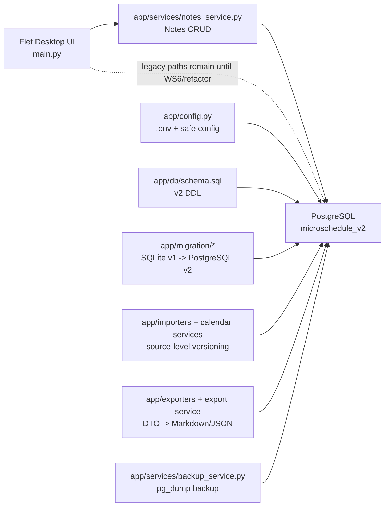

# microSchedule v2 System Architecture

Ngay cap nhat: 2026-05-25

Tai lieu nay mo ta kien truc hien tai cua nhanh `develop`. Tu thoi diem nay, `develop` duoc xem la dong phat trien v2. Ban v1 duoc bao luu tren nhanh `main` va chi con duoc nhac trong archive/legacy docs.

## 1. Kien Truc Tong Quan

Core decision:
- PostgreSQL v2 la data store chinh tren `develop`.
- Calendar event bat buoc thuoc `calendar_sources` va `calendar_source_versions`.
- Notes tach khoi tasks; note khong co due date bat buoc.
- Export tao DTO chung, render ra Markdown mac dinh hoac JSON.
- Backup dung `pg_dump -Fc` vao thu muc v2 da sync Google Drive.

## 2. Cac Subsystem Chinh

### Database And Migration

- `app/db/schema.sql` la DDL authoritative cho v2.
- `app/migration/analyze_v1_sqlite.py` chi doc SQLite v1 o che do read-only.
- `app/migration/migrate_sqlite_to_postgres.py` migrate one-shot vao `microschedule_v2`, co dry-run va guard `--reset-dev-db`.
- Ket qua migration hien tai nam trong `docs/V2_MIGRATION_REPORT.md`.

### Calendar Import

- Calendar source dai dien cho nguon lich: lich hoc, lich thi, ngay le, lich khac.
- Moi lan import/update tao mot `calendar_source_versions` moi.
- Calendar chi doc active snapshot qua `calendar_sources.current_version_id`.
- Import cung checksum cho cung source tra `duplicate_noop`, khong tao duplicate active events.

### Tasks And Notes

- `tasks` danh cho viec co han/action.
- `notes` danh cho ghi chu/idea khong bi ep due date.
- 29 incomplete overdue tasks cua v1 da duoc migrate thanh notes.
- WS5 da them Notes UI vao `main.py`, backed by PostgreSQL `notes` va `note_items`.

### Export

- `PlannerExportDTO` la contract noi bo.
- Markdown la format mac dinh cho AI/chat workflow.
- JSON giu lai cho tool/agent va automation.
- Export chi lay calendar events tu active source versions.

### Backup And Restore

- `BackupService` chay `pg_dump -Fc`, ghi file tam roi atomic rename.
- Backup logs ghi vao `backup_runs`.
- Restore verification da duoc chay: restore latest dump vao DB tam, compare counts, drop DB tam.
- Chi tiet xem `docs/V2_BACKUP_RESTORE.md` va `docs/V2_RESTORE_VERIFICATION_REPORT.md`.

## 3. Runtime Status

Da co tren `develop`:
- PostgreSQL schema + migration.
- Import source versioning.
- Export Markdown/JSON.
- PostgreSQL backup/restore verification.
- Notes service + Notes UI.

Con lai:
- WS6 continuous calendar UI thay month grid cu.
- WS7 AI agent/tools voi permission, audit, backup checkpoint.
- Refactor cac legacy UI path con lai trong `main.py` sang services v2.

## 4. Legacy v1 Preservation

Ban v1 duoc bao luu tren nhanh `main`. Khong xoa `main.py`/`database.py` trong buoc hien tai vi `main.py` van la Flet shell dang duoc refactor dan sang v2.

Tai lieu legacy:
- `docs/archive/v1_legacy/README.md`

Sau WS6 va UI v2 smoke test pass, co the lap task rieng de go bo SQLite runtime path khoi `develop`.

## 5. Source Of Truth

| Muc dich | Tai lieu/code |
|---|---|
| Trang thai v2 | `docs/V2_CURRENT_STATE.md` |
| Quyet dinh kien truc | `docs/V2_DECISION_BRIEF.md` |
| Contract schema/migration | `docs/v2_contracts/WS0_WS1_CONTRACT.md` |
| PostgreSQL DDL | `app/db/schema.sql` |
| Migration counts | `docs/V2_MIGRATION_REPORT.md` |
| Backup/restore | `docs/V2_BACKUP_RESTORE.md`, `docs/V2_RESTORE_VERIFICATION_REPORT.md` |
| Strategy docs | `docs/strategy/` |
